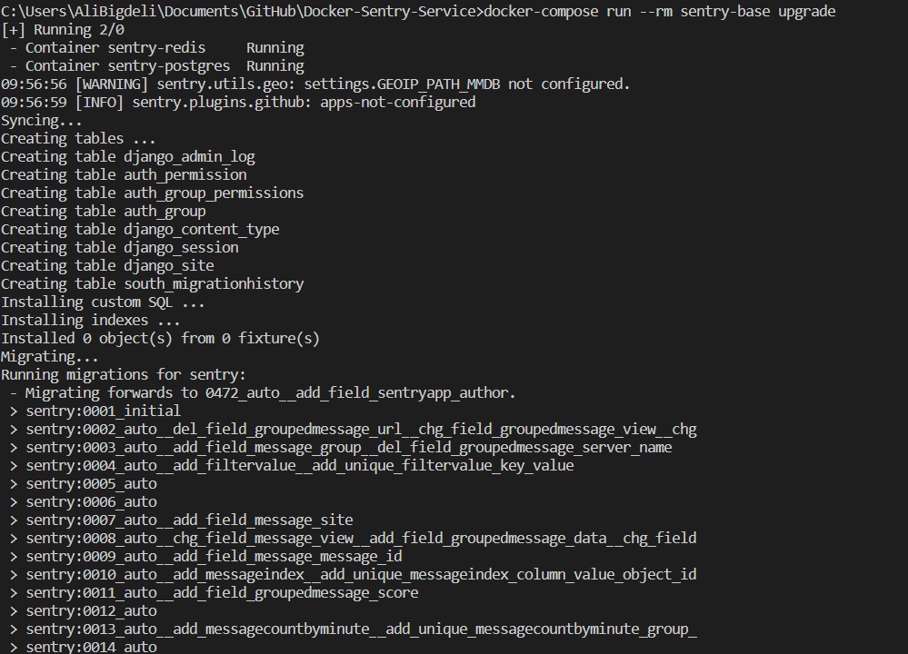
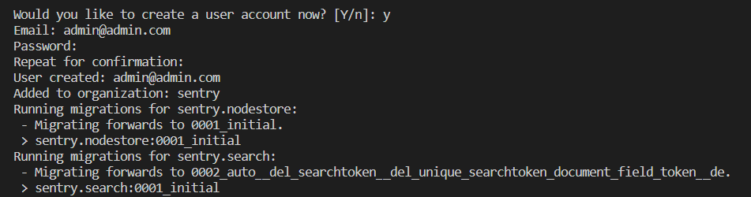
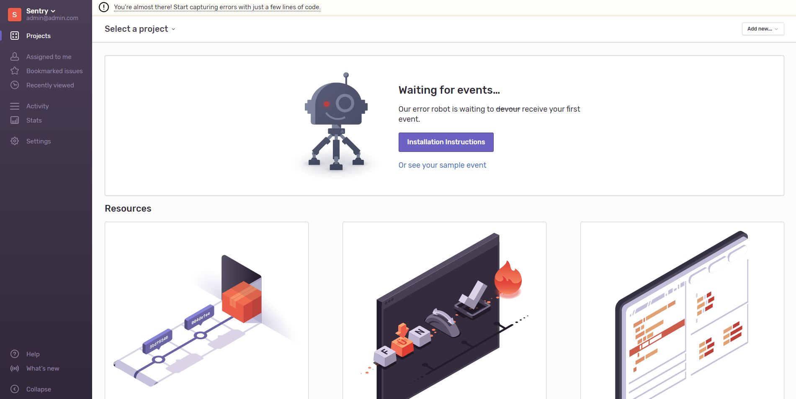

<div align="center">

<h1 align="center">Sentry Docker Setup</h1>
<h3 align="center">Sample docker deployment of sentry for dev purposes</h3>
</div>


# Guideline
- [Guideline](#guideline)
- [What is Sentry](#what-is-sentry)
- [How to setup locally](#how-to-setup-locally)
  - [using docker-compose](#using-docker-compose)
    - [first time setup:](#first-time-setup)
    - [up and running](#up-and-running)
- [License](#license)
- [Bugs](#bugs)


# What is Sentry

For software teams, Sentry is essential for monitoring application code health. From Error tracking to Performance monitoring, developers can see clearer, solve quicker, and learn continuously about their applications - from frontend to backend. Loved by over 1 million developers and 70,000 organizations worldwide, Sentry provides code-level observability to many of the world's best-known companies like Disney, Peloton, Cloudflare, Eventbrite, Slack, Supercell, and Rockstar Games.

# How to setup locally
of course sentry can be accessible online from <https://sentry.io> or through hamravesh with <https://sentry.hamravesh.com> but sometimes you need to have it locally for testing purposes.

## using docker-compose
in order to run and use sentry with docker-compose all you have to do is to run the command bellow in the same directory of docker-compose.yml file.

### first time setup:
```shell
docker-compose up --build
```
wait till its done, then run the command bellow to setup database and tables, plus creating a new user:
```shell
docker-compose run --rm sentry-base upgrade
```
it should be starting to migrate like the image bellow:

<div align="center"></div>

**Note:** in the process you will be asked to create a new user for login then add a new one by providing email and password.
<div align="center"></div>

then open the url below and continue your setup till you reach the dashboard.
- <http://127.0.0.1:9000>


<div align="center"></div>

then create django project . after that you get your specific data like DSN that you should paste it on settings.py . <br>

in your environment install sentry-sdk : <br>
``` python
pip install --upgrade sentry-sdk
```


then for creating random error , in project/urls.py paste this : <br>


after running your project , refer to http://localhost:8000/sentry-debug , so see this error : <br>


### up and running
if this is not your first setup and you have already created the database and migrated, all you have to do is to just run the docker-compose file:
```shell
# for starting again
docker-compose up 

# or for restarting
docker-compose restart

# or for stopping
docker-compose stop

# or for removing service
docker-compose down
```
based on the situation you want you can pick one, and execute.

# License
MIT.


# Bugs
Feel free to let me know if something needs to be fixed. or even any features seems to be needed in this repo.


